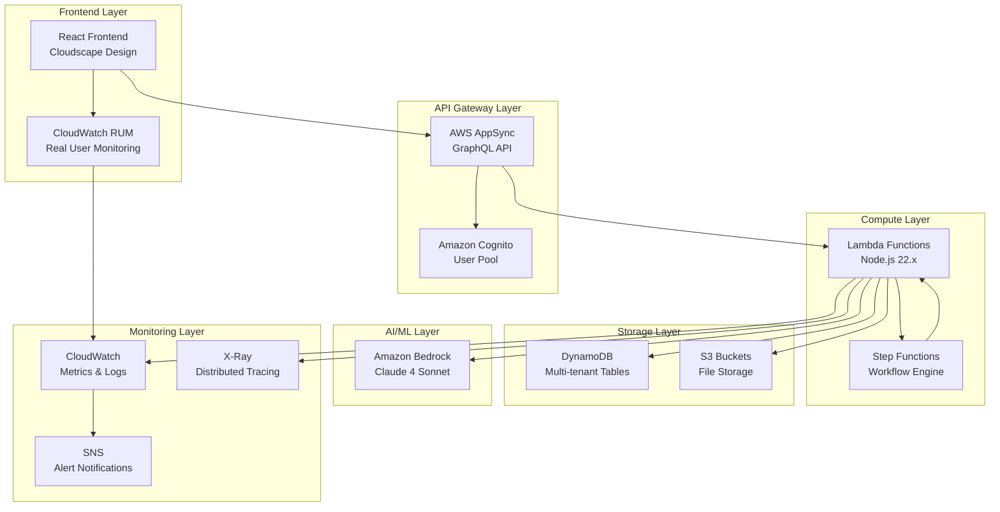
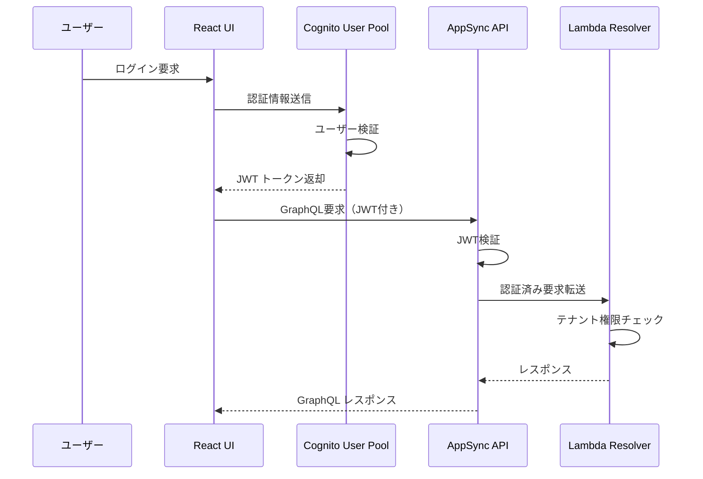
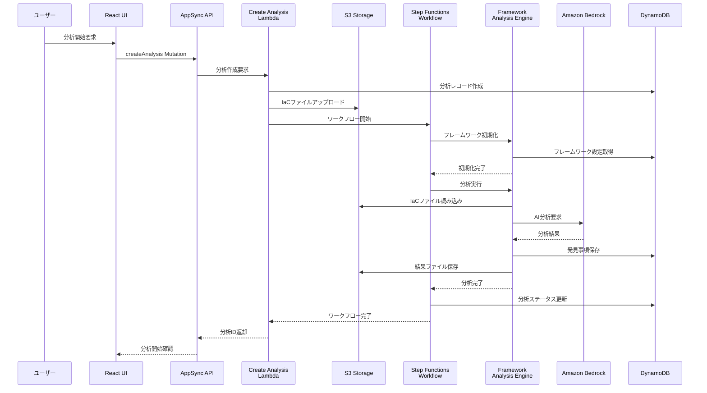
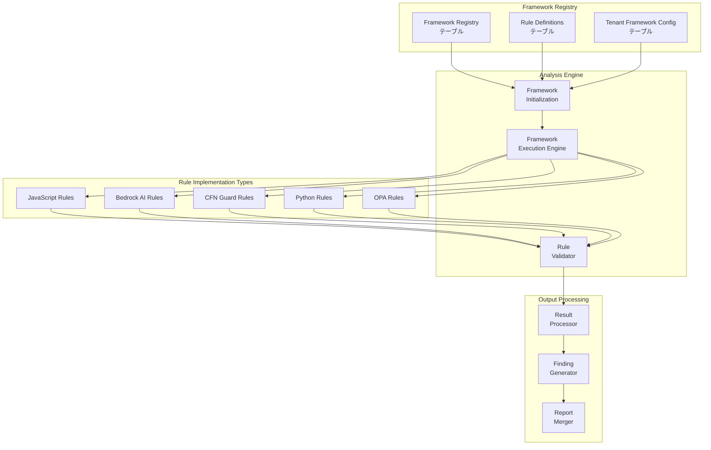
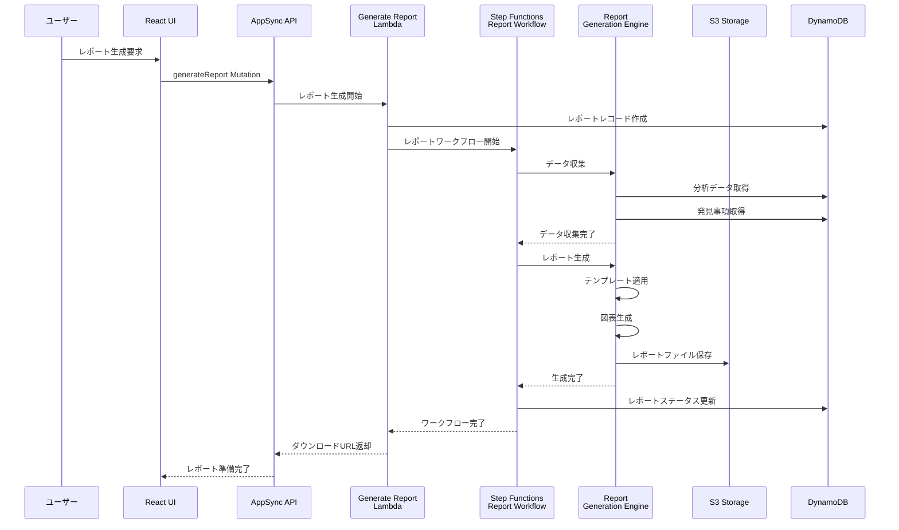
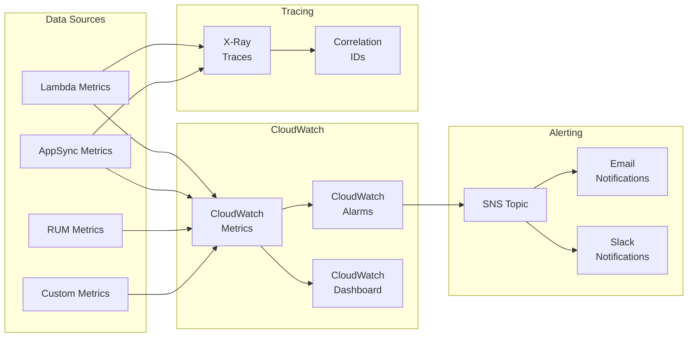
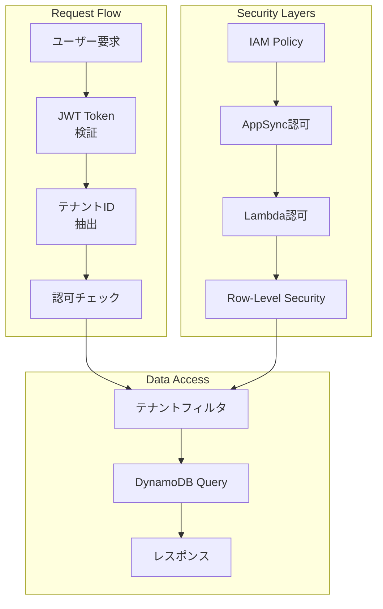
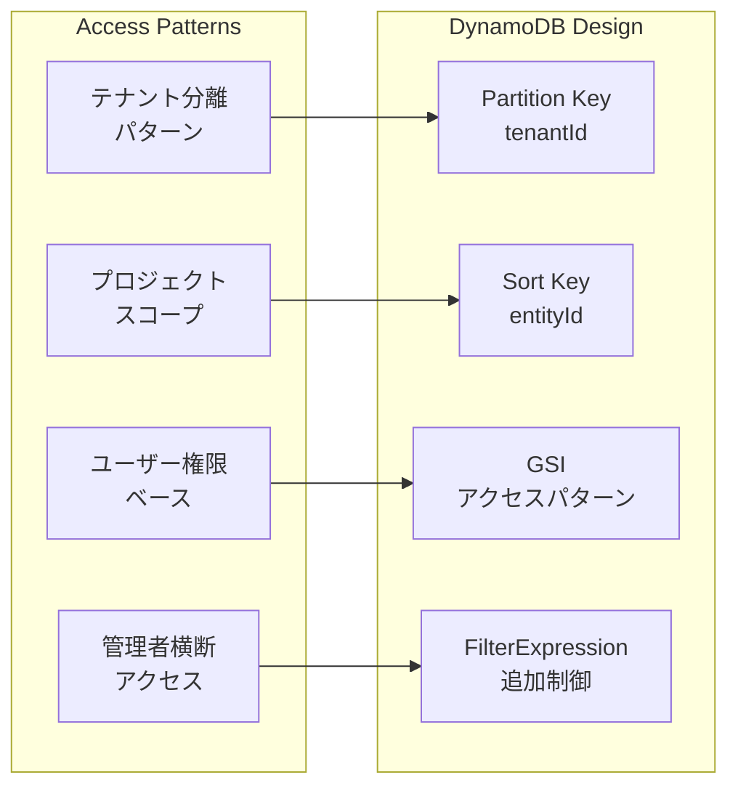
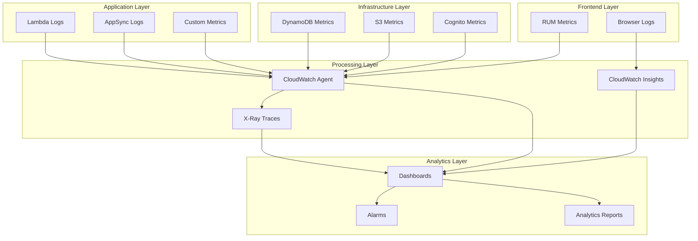
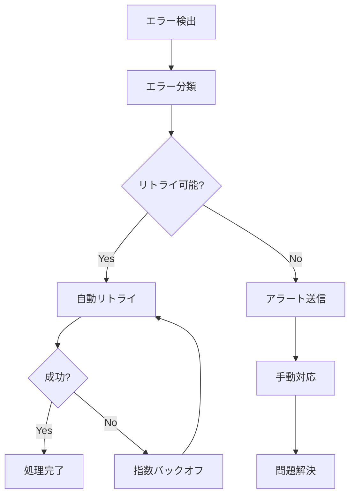

# データフローアーキテクチャドキュメント

## 概要

CloudBestPracticeAnalyzer は、マルチテナント対応のServerless SaaS IaC Analyzerとして、複数のAWSサービスを組み合わせて包括的なデータフローを実現しています。本ドキュメントでは、システム全体のデータフロー、各コンポーネント間の相互作用、および主要な処理パターンについて詳述します。

## システムアーキテクチャ概要



## 主要データフロー

### 1. ユーザー認証・認可フロー



**データポイント:**
- **入力**: ユーザー認証情報（Email/Password）
- **中間**: JWT トークン、テナントID、ユーザーロール
- **出力**: 認証済みセッション、ユーザープロファイル
- **ストレージ**: Users テーブル（DynamoDB）

### 2. IaC分析実行フロー



**データポイント:**
- **入力**: IaCファイル（CloudFormation/Terraform/CDK）、分析設定
- **中間**: ワークフロー状態、フレームワーク設定、AI分析結果
- **出力**: 分析レポート、発見事項、推奨事項
- **ストレージ**: 
  - Analyses テーブル（分析メタデータ）
  - Findings テーブル（発見事項詳細）
  - S3（IaCファイル、結果ファイル）

### 3. マルチフレームワーク分析フロー



**フレームワーク処理順序:**
1. **Well-Architected Framework**: 6つの柱による基本分析
2. **Security Hub CSPM**: セキュリティ関連チェック
3. **Service Delivery Practices**: 運用ベストプラクティス
4. **AWS Competency**: 認定要件チェック
5. **Custom Framework**: テナント固有ルール

### 4. レポート生成フロー



**レポート形式:**
- **PDF**: エグゼクティブサマリー
- **Excel**: 詳細分析データ
- **JSON**: API連携用データ
- **HTML**: Web表示用レポート

### 5. リアルタイム監視・アラートフロー



**監視メトリクス:**
- **パフォーマンス**: レスポンス時間、スループット、エラー率
- **ビジネス**: 分析実行数、テナント数、クォータ使用率
- **インフラ**: Lambda実行時間、DynamoDB消費容量、S3使用量
- **ユーザー体験**: RUMメトリクス、Core Web Vitals

## テナント分離データフロー

### マルチテナント アクセス制御



**テナント分離の実装:**
1. **JWT レベル**: Cognitoでテナント情報を含むトークン発行
2. **AppSync レベル**: GraphQLフィールドレベルの認可
3. **Lambda レベル**: 関数内でのテナントフィルタリング
4. **DynamoDB レベル**: 全クエリにテナントIDを必須化

### データアクセスパターン



## データ永続化戦略

### DynamoDB テーブル設計

| テーブル名 | 主要用途 | アクセスパターン | 分離方法 |
|------------|----------|------------------|----------|
| Tenants | テナント管理 | Admin横断参照 | 管理者権限制御 |
| Projects | プロジェクト管理 | テナント内参照 | tenantId PK |
| Analyses | 分析管理 | プロジェクト内参照 | tenantId + projectId |
| Findings | 発見事項 | 分析内参照 | tenantId + analysisId |
| Reports | レポート管理 | プロジェクト内参照 | tenantId + projectId |
| Users | ユーザー管理 | テナント内参照 | tenantId PK |
| FrameworkRegistry | フレームワーク | Global共有 | バージョン管理 |
| RuleDefinitions | ルール定義 | フレームワーク内 | バージョン管理 |
| TenantFrameworkConfig | テナント設定 | テナント内参照 | tenantId PK |
| TenantAnalytics | 分析統計 | テナント内参照 | tenantId PK |
| GlobalAnalytics | システム統計 | Admin専用 | 管理者権限制御 |

### S3 データ組織化

```
application-data-bucket/
├── tenants/
│   ├── {tenantId}/
│   │   ├── projects/
│   │   │   ├── {projectId}/
│   │   │   │   ├── analyses/
│   │   │   │   │   ├── {analysisId}/
│   │   │   │   │   │   ├── input/          # IaCファイル
│   │   │   │   │   │   ├── output/         # 分析結果
│   │   │   │   │   │   └── reports/        # 生成レポート
│   │   │   │   │   └── ...
│   │   │   │   └── ...
│   │   │   └── ...
│   │   └── settings/                       # テナント設定
│   └── ...
├── frameworks/                             # フレームワーク定義（共有）
│   ├── well-architected/
│   ├── security-hub/
│   └── custom/
└── templates/                              # レポートテンプレート（共有）
    ├── pdf/
    ├── excel/
    └── html/
```

## パフォーマンス最適化

### 1. DynamoDB 最適化

- **読み取りパターン**: Hot Partitionを避ける分散設計
- **書き込みパターン**: Batch操作でスループット向上
- **GSI設計**: クエリパターンに最適化されたインデックス
- **TTL**: 期限切れデータの自動削除

### 2. Lambda 最適化

- **コールドスタート対策**: Provisioned Concurrency（本番環境）
- **メモリ設定**: CPU性能とコスト最適化
- **レイヤー活用**: 共通ライブラリの効率的共有
- **バンドルサイズ**: esbuildによる最適化

### 3. S3 最適化

- **プレフィックス**: 並列処理を考慮した分散
- **圧縮**: 大容量ファイルの効率的保存
- **ライフサイクル**: 古いデータの自動アーカイブ
- **転送高速化**: CloudFront経由でのダウンロード

## セキュリティデータフロー

### 1. 認証・認可チェーン

```
User Request → Cognito JWT → AppSync Authorization → Lambda Execution → DynamoDB Access
     ↓              ↓                ↓                      ↓               ↓
WAF Protection → JWT Validation → Field Authorization → Tenant Filtering → Row Security
```

### 2. データ暗号化

- **転送時**: HTTPS/TLS 1.3（全通信）
- **保存時**: DynamoDB暗号化、S3暗号化（KMS）
- **メモリ内**: 機密データの適切なライフサイクル管理

### 3. 監査・コンプライアンス

- **CloudTrail**: API呼び出しログ
- **DynamoDB Streams**: データ変更監査
- **X-Ray**: リクエストトレーシング
- **カスタムログ**: ビジネスロジック監査

## 運用・監視データフロー

### メトリクス収集パイプライン



## エラーハンドリング・復旧フロー

### 1. エラー分類と対応

| エラータイプ | 検出方法 | 対応策 | 復旧手順 |
|-------------|---------|--------|---------|
| 認証エラー | JWT検証失敗 | 再認証促す | トークンリフレッシュ |
| 認可エラー | テナントアクセス違反 | アクセス拒否 | 権限確認・修正 |
| ビジネスロジックエラー | バリデーション失敗 | エラーメッセージ表示 | 入力値修正 |
| インフラエラー | サービス障害 | 自動リトライ | 障害復旧待機 |
| データ整合性エラー | DynamoDB制約違反 | トランザクション中止 | データ修正・再実行 |

### 2. 自動復旧メカニズム



## まとめ

CloudBestPracticeAnalyzer のデータフローは、以下の主要な特徴を持ちます：

1. **完全なテナント分離**: あらゆるレベルでのデータ分離
2. **スケーラブル設計**: サーバーレスアーキテクチャによる自動スケーリング
3. **堅牢なセキュリティ**: 多層防御によるセキュリティ確保
4. **包括的監視**: リアルタイム監視とアラート
5. **高度な分析**: AIを活用したマルチフレームワーク分析
6. **運用効率**: 自動化された運用・保守プロセス

このアーキテクチャにより、企業向けSaaSとして求められる信頼性、セキュリティ、パフォーマンスを実現しています。