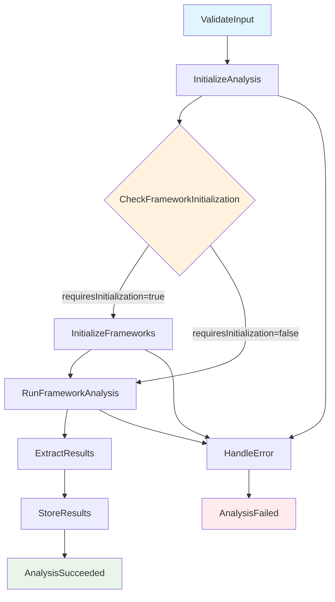
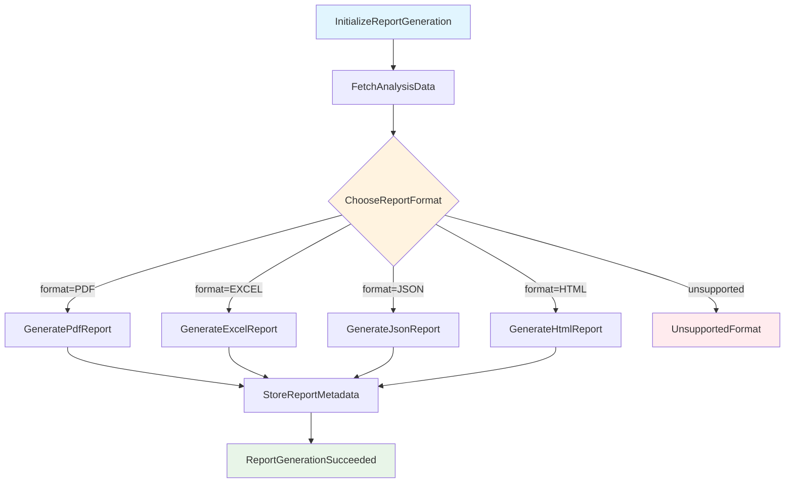

# Step Functions ワークフロー設計

このドキュメントでは、Serverless SaaS IaC Analyzerで使用されるAWS Step Functionsワークフローについて説明します。

## 概要

システムには2つの主要なStep Functionsワークフローがあります：

1. **Analysis Workflow** - マルチフレームワーク分析を実行
2. **Report Generation Workflow** - 分析結果からレポートを生成

## 1. Analysis Workflow

### ワークフローの目的
IaCリソースに対してマルチフレームワーク分析を実行し、セキュリティ、コンプライアンス、ベストプラクティスの評価を行います。

### フロー図



### 状態の詳細

#### 1. ValidateInput
- **タイプ**: Pass
- **目的**: 入力パラメータの初期検証
- **出力**: 検証済みパラメータ

#### 2. InitializeAnalysis
- **タイプ**: Pass
- **目的**: 分析セッションの初期化
- **処理**: 
  - 分析IDの生成
  - タイムスタンプの設定
  - メタデータの準備

#### 3. CheckFrameworkInitialization
- **タイプ**: Choice
- **目的**: フレームワーク初期化の必要性を判定
- **条件**: `$.requiresInitialization === 'true'`
- **分岐**:
  - True: InitializeFrameworks
  - False: RunFrameworkAnalysis

#### 4. InitializeFrameworks
- **タイプ**: Task (Lambda)
- **目的**: 分析フレームワークの初期化
- **Lambda関数**: FrameworkInitializationFunction
- **処理**:
  - デフォルトフレームワークの作成
  - ルール定義の初期化
  - テナント設定の確認

#### 5. RunFrameworkAnalysis
- **タイプ**: Task (Lambda)
- **目的**: マルチフレームワーク分析の実行
- **Lambda関数**: FrameworkAnalysisFunction
- **処理**:
  - 複数フレームワークの並列実行
  - ルール評価
  - ファインディングの生成
  - 結果の集約

#### 6. ExtractResults
- **タイプ**: Pass
- **目的**: 分析結果の抽出と正規化
- **出力形式**:
```json
{
  "analysisId": "...",
  "status": "COMPLETED",
  "overallScore": 85.5,
  "totalFindings": 15,
  "frameworks": [...],
  "aggregatedSummary": {...}
}
```

#### 7. StoreResults
- **タイプ**: Pass
- **目的**: 結果の永続化メタデータ準備

#### 8. AnalysisSucceeded
- **タイプ**: Succeed
- **目的**: 成功終了

#### エラーハンドリング

- **HandleError**: エラー情報の正規化
- **AnalysisFailed**: 失敗終了
- **エラーキャッチ**: 各Lambdaタスクで`States.ALL`をキャッチ

### 実行時間と制限

- **最大実行時間**: 2時間
- **タイムアウト**: 各Lambdaタスクは個別にタイムアウト設定
- **同時実行**: フレームワーク分析は内部で並列実行（最大3並行）

## 2. Report Generation Workflow

### ワークフローの目的
分析結果から様々な形式（PDF、Excel、JSON、HTML）のレポートを生成します。

### フロー図



### 状態の詳細

#### 1. InitializeReportGeneration
- **タイプ**: Pass
- **目的**: レポート生成プロセスの初期化

#### 2. FetchAnalysisData
- **タイプ**: Pass
- **目的**: 分析データの取得準備

#### 3. ChooseReportFormat
- **タイプ**: Choice
- **目的**: レポート形式の選択
- **分岐条件**: `$.format`の値に基づく
- **サポート形式**: PDF, EXCEL, JSON, HTML
- **エラーハンドリング**: サポートされていない形式の場合はUnsupportedFormat状態へ

#### 4. Generate[Format]Report
- **タイプ**: Pass（将来的にLambdaタスクに変更予定）
- **目的**: 指定形式でのレポート生成

#### 5. StoreReportMetadata
- **タイプ**: Pass
- **目的**: レポートメタデータの保存

#### 6. ReportGenerationSucceeded
- **タイプ**: Succeed
- **目的**: 成功終了

### 実行時間と制限

- **最大実行時間**: 30分
- **サポート形式**: PDF, Excel, JSON, HTML
- **ストレージ**: S3への保存

## 統合とトリガー

### Analysis Workflowのトリガー

1. **AppSync Mutation**: `startAnalysis`
2. **直接実行**: AWS CLIまたはSDK
3. **スケジュール実行**: EventBridge（将来実装予定）

### Report Generation Workflowのトリガー

1. **AppSync Mutation**: `generateReport`
2. **Analysis完了後**: 自動トリガー（オプション）

## モニタリングとログ

### CloudWatch統合

- **実行ログ**: すべての状態遷移をログ記録
- **メトリクス**: 実行回数、エラー率、実行時間
- **アラーム**: 失敗率の監視

### X-Ray統合

- **分散トレーシング**: 各状態とLambda実行のトレース
- **パフォーマンス分析**: ボトルネック特定

## セキュリティ考慮事項

### IAM権限

- **最小権限の原則**: 各ワークフローに必要最小限の権限
- **テナント分離**: IAM条件を使用したリソースアクセス制御

### データ保護

- **暗号化**: 実行データとログの暗号化
- **VPC統合**: 必要に応じてプライベートサブネット実行

## 今後の拡張予定

1. **バッチ分析**: 複数プロジェクトの一括分析
2. **スケジュール実行**: 定期的な自動分析
3. **カスタムレポート**: テンプレートベースレポート生成
4. **リアルタイム分析**: ストリーミング分析対応

## トラブルシューティング

### 一般的な問題

1. **タイムアウトエラー**: Lambda関数の実行時間確認
2. **権限エラー**: IAMロールとポリシーの確認
3. **入力検証エラー**: パラメータ形式の確認

### デバッグ方法

1. **CloudWatchログ**: 詳細なログ確認
2. **X-Rayトレース**: 実行フローの可視化
3. **Step Functions Console**: 状態遷移の確認