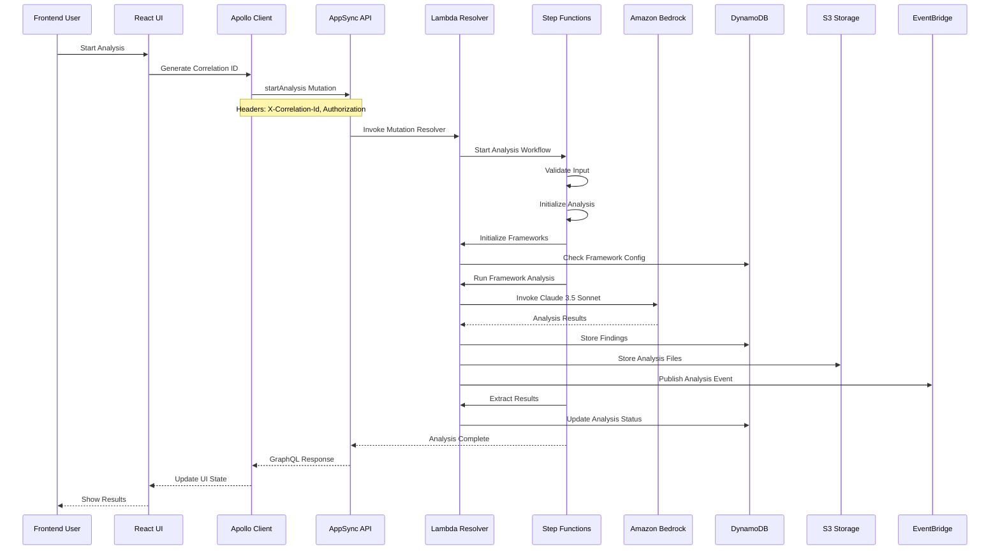
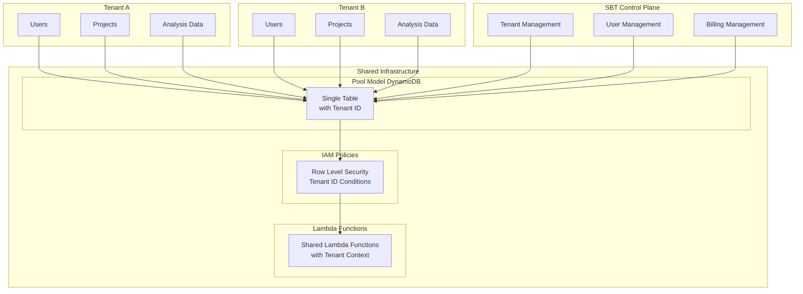
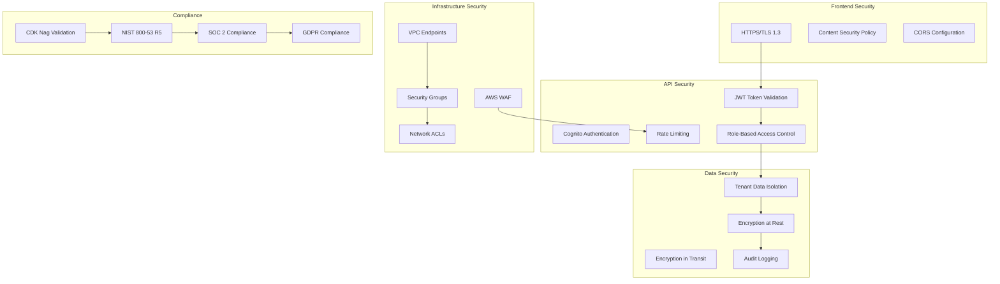
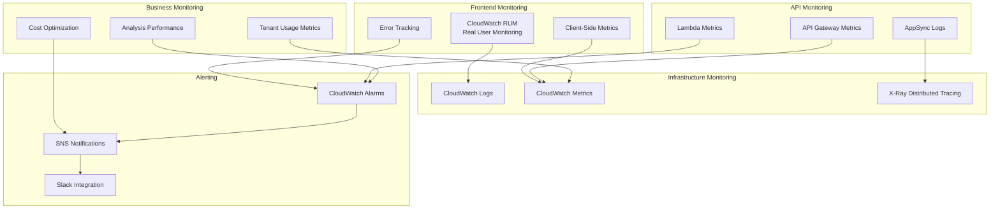

# Cloud Best Practice Analyzer - システムアーキテクチャ

## 全体アーキテクチャ図

```mermaid
graph TB
    %% Frontend Layer
    subgraph "Frontend (React + Amplify)"
        UI[React UI Components]
        Apollo[Apollo GraphQL Client]
        Auth[Cognito Authentication]
        RUM[CloudWatch RUM]
        Correlation[Correlation ID Context]
    end

    %% API Gateway Layer
    subgraph "API Layer"
        AppSync[AWS AppSync GraphQL API]
        RestAPI[REST API Gateway<br/>SBT Control Plane]
    end

    %% Authentication & Authorization
    subgraph "Auth & Identity"
        UserPool[Cognito User Pool]
        IdentityPool[Cognito Identity Pool]
        IAM[IAM Roles & Policies]
    end

    %% Compute Layer
    subgraph "Compute Services"
        subgraph "Lambda Functions"
            QueryResolvers[Query Resolvers<br/>- getTenant<br/>- getProject<br/>- getAnalysis<br/>- listFrameworks]
            MutationResolvers[Mutation Resolvers<br/>- createProject<br/>- startAnalysis<br/>- generateReport<br/>- createFrameworkSet]
            TenantMgmt[Tenant Management<br/>SBT Integration]
            DataSync[Data Sync Function<br/>SBT ↔ Amplify]
        end
        
        subgraph "Step Functions"
            AnalysisWF[Analysis Workflow<br/>Multi-Framework Processing]
            ReportWF[Report Generation Workflow<br/>PDF/Excel/JSON/HTML]
        end
    end

    %% Data Layer
    subgraph "Data Storage"
        subgraph "DynamoDB Tables"
            TenantsTable[Tenants Table<br/>Pool Model]
            ProjectsTable[Projects Table<br/>Tenant Isolated]
            AnalysesTable[Analyses Table<br/>Results & Status]
            FindingsTable[Findings Table<br/>Security Issues]
            ReportsTable[Reports Table<br/>Generated Reports]
            UsersTable[Users Table<br/>RBAC Data]
            FrameworkRegistry[Framework Registry<br/>Multi-Framework System]
            RuleDefinitions[Rule Definitions<br/>Analysis Rules]
            TenantFrameworkConfig[Tenant Framework Config<br/>Custom Settings]
            TenantAnalytics[Tenant Analytics<br/>Usage Metrics]
            GlobalAnalytics[Global Analytics<br/>Cross-Tenant Insights]
            SBTTenants[SBT Tenants Table<br/>Control Plane Data]
        end
        
        subgraph "S3 Storage"
            AppDataBucket[Application Data Bucket<br/>Analysis Files]
            TemplatesBucket[Templates Bucket<br/>Report Templates]
            LogsBucket[Logs Bucket<br/>Audit & Access Logs]
        end
    end

    %% AI/ML Services
    subgraph "AI Services"
        Bedrock[Amazon Bedrock<br/>Claude 3.5 Sonnet<br/>Analysis Engine]
    end

    %% Monitoring & Observability
    subgraph "Monitoring"
        CloudWatch[CloudWatch<br/>Logs & Metrics]
        XRay[X-Ray<br/>Distributed Tracing]
        EventBridge[EventBridge<br/>SBT Events]
    end

    %% Security & Compliance
    subgraph "Security"
        CDKNag[CDK Nag<br/>Security Validation]
        Encryption[Encryption at Rest<br/>& in Transit]
        VPC[VPC<br/>Network Isolation]
    end

    %% External Integrations
    subgraph "External Systems"
        SBTControlPlane[SBT Control Plane<br/>Multi-Tenant Management]
        CloudFormation[CloudFormation<br/>Infrastructure Analysis]
        Terraform[Terraform<br/>Infrastructure Analysis]
        CDKCode[AWS CDK<br/>Infrastructure Analysis]
    end

    %% Connections
    UI --> Apollo
    Apollo --> AppSync
    Auth --> UserPool
    UserPool --> IdentityPool
    IdentityPool --> IAM
    
    AppSync --> QueryResolvers
    AppSync --> MutationResolvers
    RestAPI --> TenantMgmt
    RestAPI --> DataSync
    
    QueryResolvers --> TenantsTable
    QueryResolvers --> ProjectsTable
    QueryResolvers --> AnalysesTable
    QueryResolvers --> FrameworkRegistry
    
    MutationResolvers --> AnalysisWF
    MutationResolvers --> ReportWF
    MutationResolvers --> TenantsTable
    MutationResolvers --> ProjectsTable
    
    AnalysisWF --> Bedrock
    AnalysisWF --> FindingsTable
    AnalysisWF --> AnalysesTable
    
    ReportWF --> ReportsTable
    ReportWF --> AppDataBucket
    
    TenantMgmt --> SBTTenants
    TenantMgmt --> EventBridge
    DataSync --> EventBridge
    
    EventBridge --> TenantAnalytics
    EventBridge --> GlobalAnalytics
    
    %% External connections
    AnalysisWF --> CloudFormation
    AnalysisWF --> Terraform
    AnalysisWF --> CDKCode
    
    SBTControlPlane --> EventBridge
    
    %% Monitoring connections
    QueryResolvers --> CloudWatch
    MutationResolvers --> CloudWatch
    AnalysisWF --> XRay
    ReportWF --> XRay
    RUM --> CloudWatch
    Correlation --> XRay

    %% Styling
    classDef frontend fill:#e3f2fd
    classDef api fill:#f3e5f5
    classDef auth fill:#e8f5e8
    classDef compute fill:#fff3e0
    classDef data fill:#fce4ec
    classDef ai fill:#e0f2f1
    classDef monitoring fill:#f1f8e9
    classDef security fill:#ffebee
    classDef external fill:#f5f5f5

    class UI,Apollo,Auth,RUM,Correlation frontend
    class AppSync,RestAPI api
    class UserPool,IdentityPool,IAM auth
    class QueryResolvers,MutationResolvers,TenantMgmt,DataSync,AnalysisWF,ReportWF compute
    class TenantsTable,ProjectsTable,AnalysesTable,FindingsTable,ReportsTable,UsersTable,FrameworkRegistry,RuleDefinitions,TenantFrameworkConfig,TenantAnalytics,GlobalAnalytics,SBTTenants,AppDataBucket,TemplatesBucket,LogsBucket data
    class Bedrock ai
    class CloudWatch,XRay,EventBridge monitoring
    class CDKNag,Encryption,VPC security
    class SBTControlPlane,CloudFormation,Terraform,CDKCode external
```

## データフロー図

## マルチテナント分離アーキテクチャ

## セキュリティアーキテクチャ

## 監視・可観測性アーキテクチャ

## 技術スタック概要

| Layer | Technology | Purpose |
|-------|------------|---------|
| Frontend | React + TypeScript + Apollo Client | ユーザーインターフェース |
| API | AWS AppSync GraphQL | API Gateway & リアルタイム |
| Authentication | AWS Cognito | 認証・認可 |
| Compute | AWS Lambda + Step Functions | サーバーレス処理 |
| AI/ML | Amazon Bedrock (Claude 3.5 Sonnet) | 分析エンジン |
| Database | DynamoDB (Pool Model) | NoSQL データストア |
| Storage | Amazon S3 | ファイルストレージ |
| Monitoring | CloudWatch + X-Ray + RUM | 可観測性 |
| Security | CDK Nag + IAM + VPC | セキュリティ |
| Multi-Tenancy | SBT (SaaS Builder Toolkit) | テナント管理 |
| IaC | AWS CDK + TypeScript | インフラ定義 |

このアーキテクチャは、スケーラブルで安全なマルチテナントSaaSアプリケーションとして設計されており、AWS Well-Architected Frameworkの5つの柱（運用性、セキュリティ、信頼性、パフォーマンス効率、コスト最適化）に準拠しています。